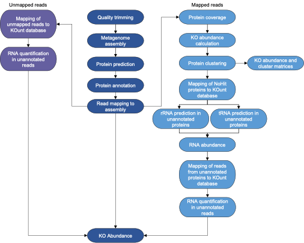

# KOunt
Snakemake pipeline calculating KEGG orthologue abundance in metagenomic sequence data.

## Documentation
KOunt is a Snakemake pipeline that calculates the abundance of KEGG orthologues (KOs) in metagenomic sequence data. KOunt takes raw paired-end reads and quality trims, assembles, predicts proteins and annotates them. The reads are mapped to the assembly and protein coverage calculated. The annotated proteins are clustered at 100%, 90% and 50% identity within each KO to quantify their diversity.
All predicted proteins that don’t have a KO hit are called ‘NoHit’. The NoHit proteins are blasted against a custom uniprot database annotated with a KO and the nucleotides against a custom RNA database. Unannotated proteins are screened for rRNA and tRNA using Barrnap and tRNAscan-SE. Reads mapped to NoHit proteins that remain unannotated are blasted against the KOunt databases and RNA quantified in the remaining reads.

## Workflow


## Installation
### Dependencies
Install [Conda](https://conda.io/en/latest/) or [Miniconda](https://conda.io/en/latest/miniconda.html)


### Source
Download the latest version of the Snakefile, scripts and conda env files.
```
git clone https://github.com/WatsonLab/KOunt
cd KOunt/
```
### Prepare the reference databases
Download the KOunt UniProt and RNA databases.
```
wget https://figshare.com/articles/online_resource/KOunt_databases_v1_tar/21269715
tar -xzvf KOunt_databases.tar
gunzip KOunt_databases/*
```
If you wish to update these databases, further information on how they were created is available [here](https://github.com/WatsonLab/KOunt/blob/main/KOunt_database_preparation).

### Install Snakemake
```
conda env create -f envs/snakemake.yaml
```

### Install the conda environments
```
source activate snakemake
snakemake --use-conda --conda-create-envs-only
```
If using Snakemake without mamba beinng installed include the option ```--conda-frontend conda```

## Running KOunt
Amend the options config file, config.yaml, with your fastq file locations and extensions.
To use the default rule all in the Snakefile and run the entire pipeline do:
```
snakemake -k --ri --use-conda
```

If you wish to only run part of the pipeline you can specify another rule all.

To perform all steps but the protein clustering use:
```
snakemake -k --ri --use-conda all_without_clustering
```
To perform all steps but protein clustering and read/protein annotation with the KOunt database:
```
snakemake -k --ri --use-conda all_without_reference
```
To perform all steps but protein clustering and RNA abundance quantification:
```
snakemake -k --ri --use-conda all_without_RNA
```
## Options
The following options can be amended in the config.yaml file:

* `raw_reads` the path to the directory containing all the raw reads (default: "reads/")<br />
* `r1_ext` the extension of read one (default: "_R1.fastq.gz")<br />
* `r2_ext` the extension of read two (default: "_R2.fastq.gz")<br />
* `diamond_db` the path to the KOunt DIAMOND database (default: "KOunt_databases/KO_DI_1.0.dmnd")<br />
* `mmseq_db` the path to the KOunt MMseqs2 database (default: "KOunt_databases/KO_RNA_1.0.mmseq")<br />
* `combined_bdg` the path to the KOunt database bedGraph file (default: "KOunt_databases/KO_RNA_DI_1.0.bedgraph")<br />
* `kallisto` the path to the KOunt kallisto reference (default: "KOunt_databases/KO_RNA_kallisto_1.0")
* `outdir` the path to the output directory (default: "out/")
				
#### Raw read trimming (rule trim)
* `r1ad` the adapter sequence for read one (default: "AGATCGGAAGAGC")<br />
* `r2ad` the adapter sequence for read two (default: "AGATCGGAAGAGC")<br />
* `polyg` use -g to enable trimming of polyG tails (default: "")<br />
* `qual` use -Q to disable quality filtering (default: "")<br />
* `minlen` the minimum required read length (default: "50")<br />
* `overlap` the minimum required length of an overlap of PE reads (default: "5")<br />
* `trim_threads` the number of threads (default: "4")<br />

#### Assembly (rule megahit)
* `mega_mem` the maximum memory megahit can use (default: "4.8e+10”)
* `mega_threads` the number of threads (default: "8")
* `mega_kmers` the kmer sizes (default: "27,37,47,57,67,77,87")
* `mega_len` the minimum required contig length (default: "300")

#### Mapping (rule bwa)
* `bwa_threads` the number of threads (default: "4")

#### Coverage (rule coverage)
* `cov_split` the number of chunks to split the BAM file into. The bigger the number of chunks, the memory required decreases but run time increases (default: “10”)

#### KEGG database download (rule kegg_db)
* `db` the path to the kofamscan database. Amend if you have an alternate version you wish to use, default will download the current database version (default: “out/Kofamscan/kofam/”)

#### Kofamscan (rule kofamscan)
* `kofamscan_threads` the number of threads (default: “4”)

#### CD-HIT (rule cdhit)
* `cdhit_mem` the maximum memory CD-HIT can use (default: “32000”)
* `cdhit_threads` the number of threads (default: “8”)

#### MMseqs2 KOs (rule mmseq_keggs)
* `mmseq_keggs_threads` the number of threads (default: “8”)

#### MMseqs2 NoHit (rule mmseq_nohit)
* `mmseq_nohit_threads` the number of threads (default: “8”)

#### Diamond (rule diamond_search)
* `dia_threads` the number of threads (default: “8”)
* `min_qc` the minimum percentage of the length of the reference hit that the protein has to be (default: “90”)
* `max_qc` the maximum percentage of the length of the reference hit that the protein has to be (default: “110”)
* `min_pid` the minimum percentage identity required to be classed as a hit (default: “80”)

#### Barrnap (rule barrnap)
* `barrnap` the number of threads (default: “4”)

#### Annotate NoHit reads (rule nohit_annotate_reads)
* `nohit` the number of threads (default: “8”)

#### Kallisto (rule kallisto)
* `kallisto_threads` the number of threads (default: “8”)

#### Unmapped read annotation (rule unmapped_reads)
* `unmapped_threads` the number of threads (default: “8”)

## Output
`Results/KOunts_Kofamscan.csv` KO abundance in each sample, calculated by Kofamscan, without read mapping
`Results/All_KOunts_nohit_unmapped_default.csv` Final KO abundance in each sample<br />
`Results/Number_of_clusters.csv` Number of clusters of proteins at 90% and 50% sequence identity in each KO, the number of clusters that contain multiple proteins and the number of singleton clusters


